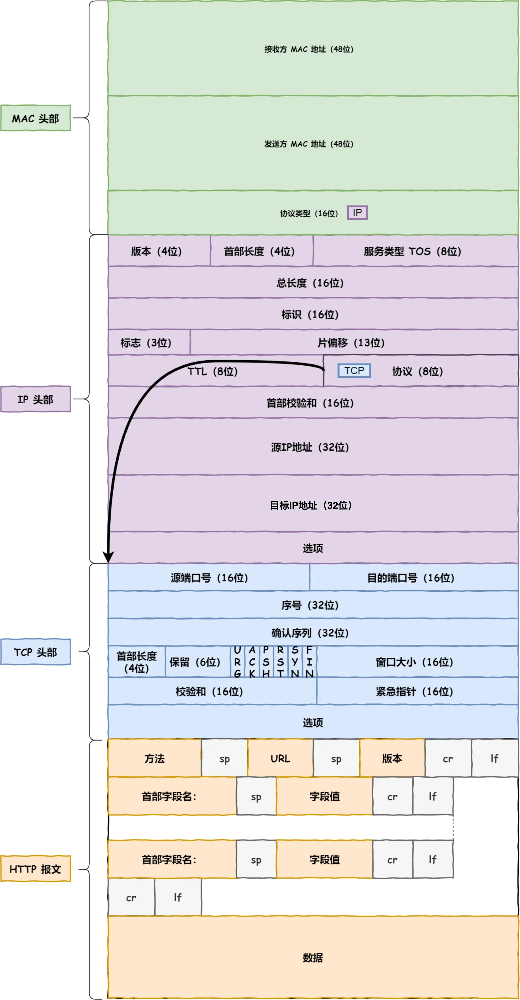
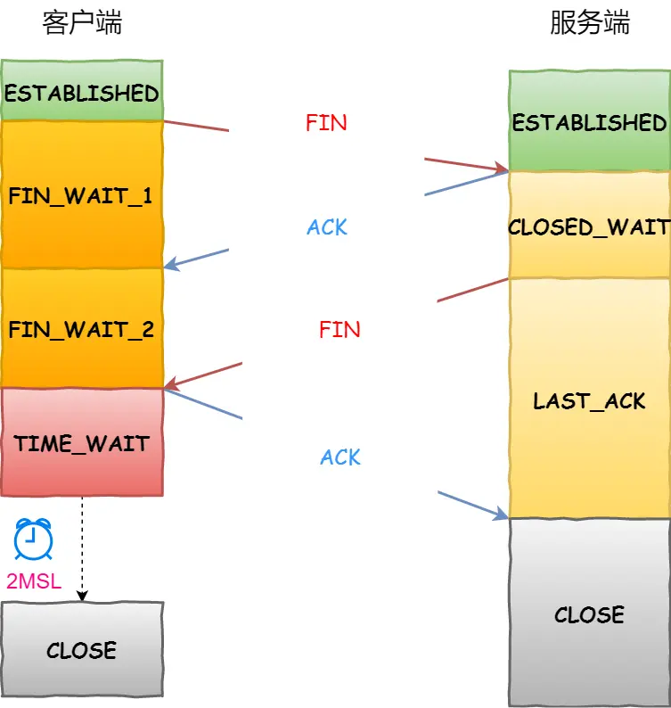
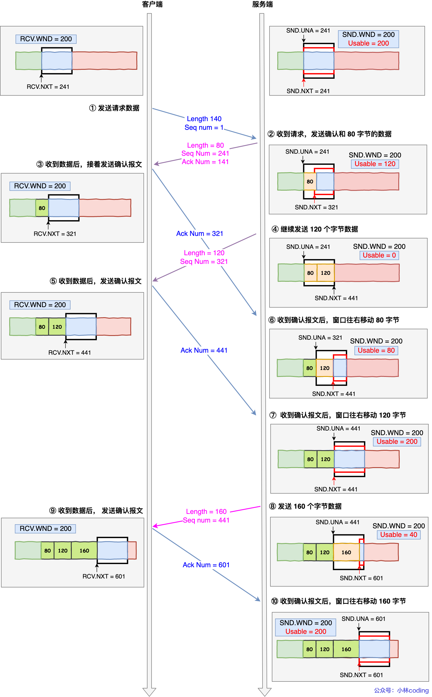
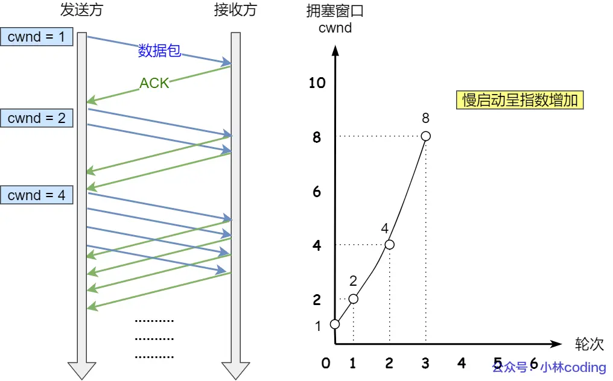
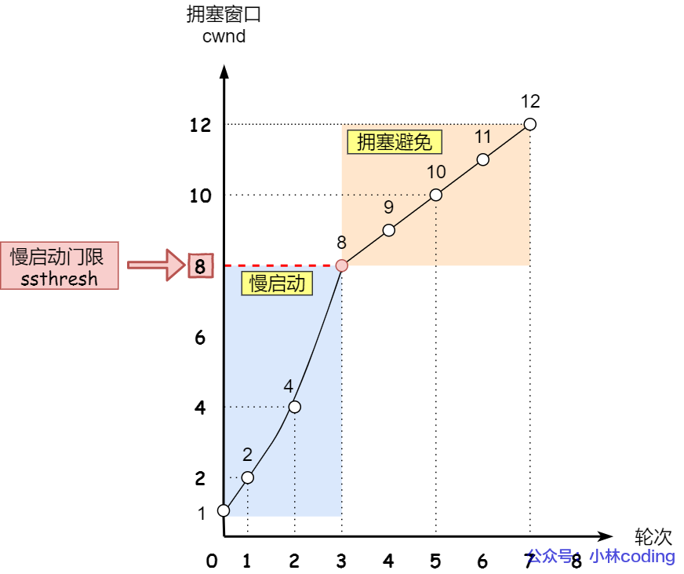
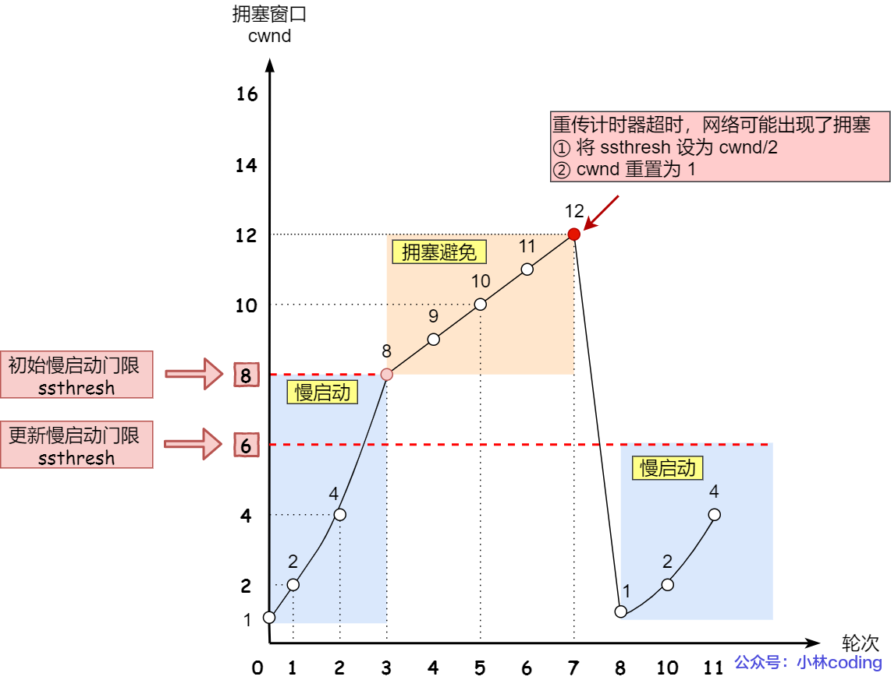
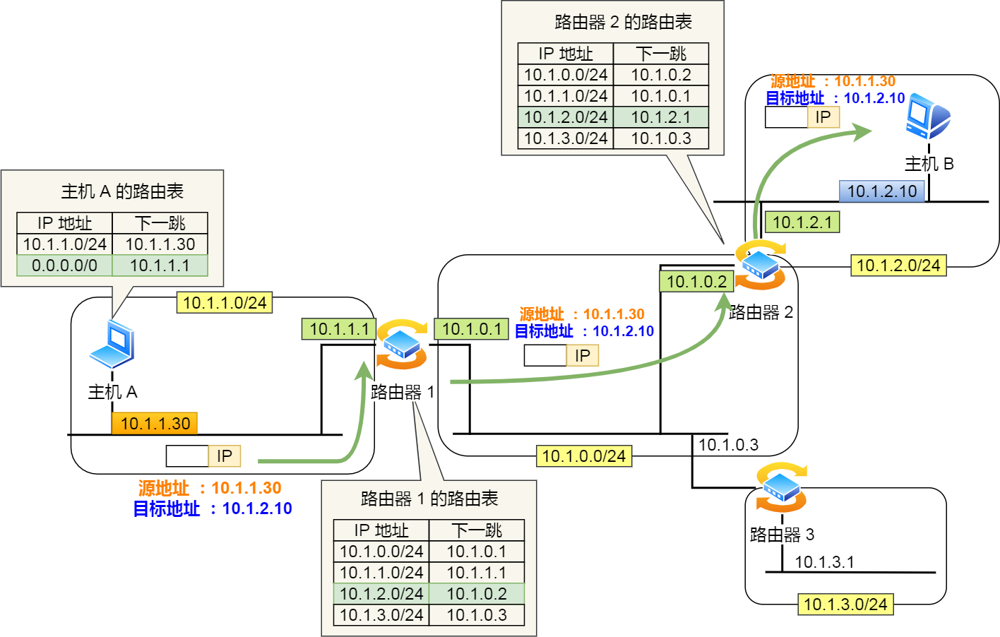
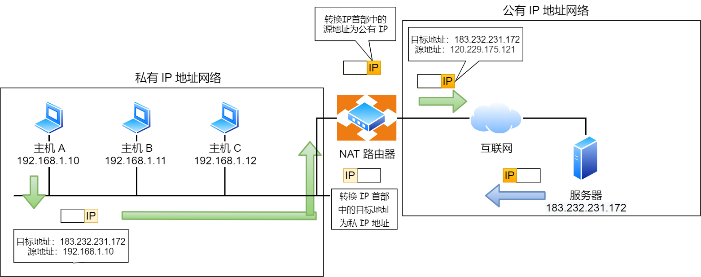

## YOLOv5疲劳驾驶检测管理服务端

### QT编程核心

QT中的信号与槽机制允许一个对象(发送者，Sender)通过发射（emit）一个信号（signal）来通知另一个对象（接收者，Receiver）某个事件的发生，接收者通过槽（slot）函数响应这个信号。

Qt信号槽机制主要利用事件循环（Event Loop）和元对象系统（Meta-Object System）的以下功能：

1.事件循环（Event Loop）

​	**事件处理**：事件循环负责接收和分发事件。当一个信号被触发时，如果接收槽函数的对象位于不同的线程，事件循环将此信号作为事件处理，确保线程安全。

​	**跨线程通信**：事件循环支持跨线程的信号和槽调用。当一个信号在一个线程内被发射，而槽在另一个线程中，事件循环将信号槽调用作为事件加入目标线程的事件队列，从而实现线程间的安全通信。

2.元对象系统

​	**信号槽连接**：元对象系统提供了一种机制来动态识别和连接信号与槽。这是通过运行时解析信号与槽的名字来完成的。

​	**反射能力**：元对象系统运行程序在运行时查询对象的信息，如类名，继承关系，属性，信号和槽等。这对于实现信号槽机制至关重要，因为它使得动态连接成为可能。

​	**运行时类型信息**：元对象系统使用一种特殊的运行时类型信息来支持信号与槽的匹配和验证，确保信号的参数类型和槽的参数类型兼容。

>结合事件循环和元对象系统，Qt信号槽机制用于实现对象间的通信。这种机制不仅支持简单的同步调用，也能够处理跨线程的异步调用，同时保持类型安全和运行性能

```c++
//定义信号
signals:
	void signals(); //不用实现
...
//定义槽
public slots:
	void slot(); //要有实现
...
//连接两个信号与槽 Q_OBJECT宏
connect(origin,&Origin::signals,receive,&Receive::slot);
```

连接类型，上文说了，信号与槽可以跨线程异步调用，因此连接类型有以下3种：

- 直接连接（Direct Connection）：信号发射时，槽函数立即在同一线程中执行。
- 队列连接（Queued Connection）：信号发射时，槽函数调用被放入事件队列，在接收者线程的事件循环中执行
- 自动连接（Auto Connection）（默认）：Qt自动选择直接连接或队列连接，取决于发射和接收是否是同一线程

观察者设计模式（发布/订阅模式）

>属于行为型模式的一种，它定义了一种一对多的依赖关系，让多个观察者对象同时监听某一个主题对象。以便能够更新自己

QT的信号槽机制的底层实现原理也就是观察者设计模式+类模版

**定义槽基类**

```c++
template <class TParam>
class SlotBase
{
public:
	virtual void slotFunction() = 0; //槽函数接口
	virtual ~SlotBase() = default;//虚析构
};
template <class TRecver, class TParam>
{
private:
	TRecver* m_pRecver; 
	void (TRecver::*m_func)(TParam param);
public:
	Slot(TRecver* pObj, void (TRecver::*func)(TParam))
	{	
		this->m_pRecver;
		this->m_func = func;
	}
	void slotFunction(TParam param)override
	{	
		(m_pRecver->*m_func)(param);
	}
};
```

**定义信号类**

```c++
template <class TParam>
class Signal
{
private:
	vector<SlotBase<TParam>*> signal_vector;//定义容器，保存要调用的那个槽基类
public:
	template<class TRecver>
	void addSlot(TRecver* pObj, void (TRecver::*func)(TParam))
	{
		signal_vector.push_back(new Slot<TRecver, TParam>(pObj, func));
	}
	void operator() (TParam param)
	{
		for(SlotBase<TParam>* p : signal_vector)
		{
			p->slotFunction(param);
		}
	}
	
};
```

**定义接收类**

```c++
class Recver1
{
public:
	void func1(int param)
	{
		count<<param<<endl;
	}
};
```

**定义发送类**

```c++
class SendObj
{
public:
	Signal<int> valueChanged;
public:
	void testSignal(int value)
	{
		valueChanged(value);
	}
};
```

**定义connect宏**

```c++
#define connect(sender, signal, recver, slot) (sender)->signal.addSlot(recver, slot)
```

**测试与使用**

```c++
Recver* r1 = new Recver1;
SendObj* sd = new SendObj;
connect(sd, valueChanged, r1, &Recver1::func1);
sd->testSignal(1000);
```

QT多线程技术

一、QThread类的run

新建一个继承QThread的类，重写虚函数run，通过run启动线程

```
workerThread->start();
```

这种方式需要新建一个类继承QThread实现多线程，适合常驻内存任务

二、QThread类的moveToThread

创建一个继承QObject的类，然后new一个Qthread，并将创建的类movetothread到创建好的子线程中，然后start子线程

```c++
#include <QThread>
QThread *thread = new QThread();
/*创建好的类faced*/
faced.moveToThread(thread);
/*启动线程*/
thread->start();
```

该方式可以在槽函数里面触发该线程，使用灵活

三、线程池

>当线程执行完毕后要手动释放该线程，线程池可以使得线程复用，线程池时一种锁线程处理形式，处理过程中将任务添加到队列，然后创建线程后自动启动这些任务

线程池由三部分组成，相互配合得到一个完整的线程池

1.任务队列，存储需要处理的任务，由工作线程来处理这些任务

- 通过线程池提供的API函数，将一个待处理的任务添加到任务队列，或者从任务队列中删除
- 已处理的任务会从任务队列中删除
- 线程池的使用者，也就是调用线程池函数往队列中添加任务的线程就是生产者线程

2.工作的线程，N个

- 线程池中维护一定数量的工作线程，作用是不停的读任务队列，从里边取出任务并处理
- 工作的线程相当于任务队列的消费者角色
- 如果任务队列为空，工作线程将会被阻塞（条件变量/信号量阻塞）
- 如果阻塞之后有了新的任务，生产者将阻塞解除，工作线程开始工作

3.管理者线程 1个

- 周期性的对任务队列的数量以及处于忙状态的工作线程个数进行检测

QRunnable是所有可执行对象的基类，继承QRunnable，重写虚函数void QRunnable::run()，可以用QThreadPool的一个QRunnable对象在另外的线程中运行，每个QT应用程序都有一个全局的QThreadPool对象，可以通过调用gloablInstance()来访问它

```c++
Mywork:: MyWork(): QRunnable()
{
	//任务执行完毕，该对象自动销毁
	setAutoDelete(true);
}
void Mywork::run()
{
	//线程的处理代码
	...
}
```

创建好了添加到线程池中的任务类之后，怎么添加该任务类到线程池中，怎么启动该线程池

```c++
//线程池初始化，设置最大线程池数量
QThreadPool::globalInstance()->setMaxThreadCount(4);
//添加任务，并启动该线程池
Mywork* task = new MyWork;
QThreadPool::globalInstance()->start(task);
```

### linux网络编程

熟练使用wireshark抓包软件

>TCP/IP网络模型有那几层？

**应用层**：为用户提供应用功能，比如HTTP，FTP，MQTT...

**传输层**：TCP和UDP协议，TCP协议可以实现流量控制、超时重传、拥塞控制，UDP不保证可靠连接，是面向数据交付的，当然，UDP也可以实现可靠传输，只要将TCP特性在应用层实现就可以；当传输层数据包大小超过MSS（TCP最大报文段长度），就要将数据包分块，这样做的好处，当一个分块错误或丢失了，只需要重发这一个分块，不需要将整个数据包都发送过去，通过端口号区别同一台主机上的不同应用程序端口

**网络层**：主要是IP协议，IP协议会将传输层的报文作为数据部分，再加上IP包头组装成IP报文，如果IP报文大小超过MTU（1500Byte）就会再次进行分片，网络层的IP地址是区分不同主机的，IP协议的寻址作用是告诉我们去往下一个目的地该朝哪个方向走，路由是根据【下一个目的地】选择路径。

**MAC层**：在IP头部前加上MAC头部，并封装成数据帧发送到网络上，ARP协议解析根据IP地址获取到对方的MAC地址


>键入网址到网页显示，期间发生了什么？

解析URL，生成发送给Web服务器的请求信息，Web服务器和文件路径，DNS服务器是查询服务器域名对应的IP地址，当DNS获取到IP后，就可以把HTTP的传输工作交给操作系统中的协议栈来工作，网络层中还包括ICMP协议和ARP协议。ICMP用于告知网络包传送过程中产生错误以及各种控制信息，ARP用于根据IP地址查询相应的以太网MAC地址

**可靠传输**----**TCP**

源端口号和目标端口号是不可少的，包的序号，这个是为了解决乱序问题，确认号，目的时确认发出去对方是否有收到，没收到就重新发送，这是为了解决丢包问题的，状态位，SYN发起一个连接，ACK回复确认号，RST重新连接，FIN结束连接。窗口大小，TCP要做流量控制，通信双方各声明一个窗口大小，标识自己当前能够处理能力，TCP还会做拥塞控制，TCP建立连接需要三次握手

**远程定位----IP**

TCP模块在执行连接、收发、断开等各阶段操作时，都需要委托IP模块将数据封装成网络包发送给通信对象

IP包头格式

源地址IP，客户端输出的IP地址；目标IP地址：通过DNS域名解析得到的Web服务器IP

**两点传输----MAC**

MAC包头里需要发送方MAC地址和接收方目标MAC地址，用于两点之间的传输

一般在TCP/IP通信里，MAC包头的协议类型只使用

- 0800：IP协议
- 0806：ARP协议

广播发送ARP协议，获取到该IP的MAC地址，就将该IP地址对应的MAC地址缓存在ARP缓存中，下次使用



**出口 ---- 网卡**

最后将数字信号转换为电信号，才能在网线上传输，负责这一操作的就是网卡，网卡获取到网络包之后，会将其复制到网卡的缓存中，接着会在其开头加上报头和起始帧分界符，在末尾加上用于检测错误的帧校验序列FCS。

**送别者----交换机**

将网络宝原样转发到目的地

**出镜大门---路由器**

路由器基于IP设计的，路由器的各个端口都具有MAC地址和IP地址

>路由器的包接收操作

检查MAC头部中的接收方MAC地址，是否是发给自己的包，是就放到接收缓冲区中

>查询路由表确定输出端口

完成包接收操作后，路由器就会去掉包开头的MAC头部

AC头部作用就是将包送达路由器，其中的接收方MAC地址就是路由端口的MAC地址，因此当包到达路由器之后，MAC头部的任务就完成了，于是MAC头部就会被丢弃

>路由器的发送操作

根据路由表的网关列判断对方的地址

- 如果网关是个IP地址，则这个IP地址就是要转发到的目的地址，还未抵达终点，还需要路由转发
- 如果网关为空，则IP头部的接收方IP地址就是要转发到的目的地址，也就是终于找到IP包头里的目标地址了

**Linux接收网络包的流程**

采用中断机制无法处理高性能网络场景下的数据接收，Linux内核在2.6版本引入NAPI机制，它是混合【中断和轮询】方式来接收网络包，核心就是不采用中断的方式读取数据，而是首先采用中断唤醒数据接收的服务程序，然后poll方法来轮询数据，因此，当有网络包到达时，会通过DMA技术，将网络包写入到指定的内存地址，接着网卡向CPU发起硬件中断，当CPU收到硬件中断请求后，根据中断表，调用已经注册的中断处理函数

硬件中断处理函数会做以下事情

- 需要先【暂时屏蔽中断】，因为已经中断过一次了，知道有数据发送过来，直接将数据写入内存就行了
- 接着，发起【软中断】，然后恢复刚才屏蔽的中断

**Linux发送网络包流程**

过程和接收相反

首先，应用程序会调用Socket发送数据包的接口，这是个系统调用，陷入内核态，内核会申请一个内核态的sk_buff内存，将用户待发送的数据拷贝到sk_buff内存，将其加入到发送缓冲区，接下来，网络协议栈从Socket发送缓冲区中取出sk_buff，按照TCP/IP协议栈逐层处理，如果使用TCP协议发送，先拷贝一个新的sk_buff副本，为了错误了重传，然后交给网络层，选取路由、填充IP头、netfilter过滤、对超过MTU大小的数据包进行分片，交给网络接口层（MAC层）处理，通过ARP协议获得吓一跳的MAC地址，然后对sk_buff填充帧头和帧尾，接着将sk_buff放到网卡的发送队列中，工作准备好之后，会触发【软中断】告诉网卡驱动程序，有新的网络包需要发送，驱动程序就会从发送队列中读取sk_buff，将其挂到RingBuffer中，接着将sk_buff数据映射到网卡可访问的内存DMA区域，最后触发真实发送。


- 纯裸TCP是能收发数据，但它是个无边界的数据流，上层需要定义消息格式用于定义消息边界。于是就有了各种协议，HTTP和各类RPC（远程过程调用）协议就是在TCP之上定义的应用层协议
- RPC本质上不算协议，而是一种调用方式，而像gPRC和Thrift这样的具体协议，才是协议，它们实现了PRC调用的协议。目的是希望程序员能像调用本地方法那样去调用远端服务方法。同时PRC有很多实现方式，不一定基于TCP协议
- HTTP主要用于B/S架构，而RPC更多用于C/S架构。但现在在慢慢融合了

**TCP篇**

**面向连接、可靠的、字节流**

TCP头部格式


序列号：在建立连接时由协议栈生成的随机数作为其初始值，通过SYN包传给接收端主机，每发送一次数据，就【累加】一次该【数据字节数】的大小。用来解决网络包乱序问题

确认应答号：指下一次【期望】收到的数据序列号，发送端接收到这个确认应答以后可以认为在这个序号以前的数据都已经被正常接收。用来解决丢包问题

控制位：ACK为1时，【确认应答】字段有效，TCP规定除了最初建立连接时的SYN包之外该位必须设置为1。RST为1时，表示TCP连接中出现异常必须强制断开连接。SYN为1时，表示希望建立连接，并在其【序列号】的字段进行序列号初始值的设定。FIN为1时，表示今后不会再有数据发送，希望断开连接。

再看看UDP协议头格式


UDP是面向【无连接】的通信服务，适用于某些特定场景下的数据传输服务

TCP**三次握手建立连接**


- 一开始，客户端和服务端都处于CLOSE状态。先是服务端主动监听某个端口，处于LISTEN状态
- 客户端会随机初始化序号（client_isn），将此序号置于TCP首部的【序号】字段中，同时把SYN标志置为1(表示SYN报文)，接着把第一个SYN报文发送给服务端，表示向服务端发起连接，此报文不包含应用层数据，之后客户端处于SYN-SENT状态
- 服务端收到客户端的SYN报文后，首先服务端也随机初始化自己的序号（server_isn），将此序号填入TCP首部的【序号】字段，其次把TCP首部的【确认应答号】字段填入client_isn+1，接着把SYN和ACK标志置为1，最后把该报文发给客户端，该报文不包含应用层数据，之后服务端处于SYN-RCVD状态
- 客户端收到服务端报文后，还要向服务端回应最后一个应答报文，首先该应答报文TCP首部ACK标志置为1，其次【确认应答号】字段填入server_isn+1，最后把报文发送给服务端，这次报文携带客户到服务端的数据，之后客户端处于ESTABLISHED状态
- 服务端收到客户端的应答报文后，也进入ESTABLISHED状态

至此，三次握手完成

>为什么是三次握手？

原因一：是为了防止旧的重复连接初始化造成混乱

我们考虑一个场景，客户端先发送了 SYN（seq = 90）报文，然后客户端宕机了，而且这个 SYN 报文还被网络阻塞了，服务端并没有收到，接着客户端重启后，又重新向服务端建立连接，发送了 SYN（seq = 100）报文（*注意！不是重传 SYN，重传的 SYN 的序列号是一样的*）。


客户端连续发送多次SYN建立连接的报文，在网络拥堵的情况下：

- 一个【旧SYN报文】比【最新的SYN】报文早到达服务端，那么此服务端就会回一个SYN+ACK报文给客户端，此报文中的确认号是90+1
- 客户端收到后，发现自己期望收到的确认号是100+1，于是就回RST报文
- 服务端收到RST报文后，就会释放连接
- 后续最新的SYN抵达了服务端后，客户端和服务端就可以正常完成三次握手

在两次握手的情况下，客户端没有中间状态来阻止历史连接，会导致建立历史连接，造成资源浪费

原因二：同步双方初始序列号

TCP协议的通信双方，都必须维护一个【序列号】，序列号是可靠传输的一个关键因素，作用有如下几点：

- 接收方可以去除重复数据
- 接收方可以根据数据包的序列号按序接收
- 标识发送出去的数据包中，哪些是已经别对方正确接收到的

原因三：避免资源浪费

如果只有两次握手，当客户端发送的SYN报文在网络中阻塞，客户端没有接收到ACK报文，就会重新发送SYN，由于没有第三次握手，服务端不清楚客户端是否收到了自己回复的ACK报文，所以服务端每收到一个SYN就只能先主动建立一个连接，造成资源浪漫啦。

**TCP四次挥手断开连接**



- 客户端打算关闭连接，就会发送一个TCP首部FIN标志位置为1的报文，也即FIN报文，之后客户端进入FIN_WAIT_1状态
- 服务端收到该报文后，就向客户端发送ACK应答报文，接着服务端进入CLOSE_WAIT状态
- 客户端收到服务端的ACK应答报文后，之后进入FIN——WAIT_2状态
- 等待服务端处理完数据后，也向客户端发送FIN报文，之后服务端进入LAST_ACK状态
- 客户端收到服务端的FIN报文后，就回一个ACK应答报文，之后进入TIME_WAIT状态
- 服务端收到ACK后，就进入CLOSE状态，至此服务端已经完成连接的关闭
- 客户端经过2MSL一段时间后，自动进入CLOSE状态，至此客户端也完成连接的关闭

>为什么挥手需要四次？

- 关闭连接时，客户端向服务端发送FIN时，仅仅表示客户端不再发送数据了但还能接收数据
- 服务端收到客户端的FIN报文时，先回一个ACK应答报文，而服务端可能还有数据需要处理和发送，等待服务端不再发送数据时，才发送FIN报文给客户端来同意现在的关闭连接

服务端的ACK和FIN一般都会分开发送，这是因为通常需要等待数据发送和处理完成

>如果第一次挥手丢失了，会发生什么？

客户端迟迟收不到对方的ACK，就会触发超时重传机制，重传FIN报文，最大重传次数由tcp_orphan_retries参数控制，当客户端重传FIN报文的次数超过tcp_orphan_retries后，就不再发送FIN报文，则会再等待一段时间，如果还是没能收到第二次握手，那么直接进入close状态

>如果第二次挥手丢失了，会发生什么？

ACK 报文是不会重传的，所以如果服务端的第二次挥手丢失了，客户端就会触发超时重传机制，重传 FIN 报文，直到收到服务端的第二次挥手，或者达到最大的重传次数。

>如果第三次挥手丢失了，会发生什么？

如果迟迟收不到对方的 ACK，服务端就会重发 FIN 报文，重发次数仍然由 `tcp_orphan_retrie`s 参数控制，这与客户端重发 FIN 报文的重传次数控制方式是一样的

具体过程：

- 当服务端重传第三次挥手报文的次数达到了 3 次后，由于 tcp_orphan_retries 为 3，达到了重传最大次数，于是再等待一段时间（时间为上一次超时时间的 2 倍），如果还是没能收到客户端的第四次挥手（ACK报文），那么服务端就会断开连接。
- 客户端因为是通过 close 函数关闭连接的，处于 FIN_WAIT_2 状态是有时长限制的，如果 tcp_fin_timeout 时间内还是没能收到服务端的第三次挥手（FIN 报文），那么客户端就会断开连接。

>如果第四次挥手丢失了，会发生什么？

当客户端收到服务端的第三次挥手的 FIN 报文后，就会回 ACK 报文，也就是第四次挥手，此时客户端连接进入 `TIME_WAIT` 状态。

在Linux系统，TIME_WAIT状态会持续2MSL后进入关闭状态。然后，服务端（被动关闭方）没有收到 ACK 报文前，还是处于 LAST_ACK 状态。如果第四次挥手的 ACK 报文没有到达服务端，服务端就会重发 FIN 报文，重发次数仍然由前面介绍过的 `tcp_orphan_retries` 参数控制。

具体过程：

- 当服务端重传第三次挥手报文达到 2 时，由于 tcp_orphan_retries 为 2， 达到了最大重传次数，于是再等待一段时间（时间为上一次超时时间的 2 倍），如果还是没能收到客户端的第四次挥手（ACK 报文），那么服务端就会断开连接。
- 客户端在收到第三次挥手后，就会进入 TIME_WAIT 状态，开启时长为 2MSL 的定时器，如果途中再次收到第三次挥手（FIN 报文）后，就会重置定时器，当等待 2MSL 时长后，客户端就会断开连接。

**Socket编程**


- 服务端和客户端初始化 `socket`，得到文件描述符；
- 服务端调用 `bind`，将 socket 绑定在指定的 IP 地址和端口;
- 服务端调用 `listen`，进行监听；
- 服务端调用 `accept`，等待客户端连接；
- 客户端调用 `connect`，向服务端的地址和端口发起连接请求；
- 服务端 `accept` 返回用于传输的 `socket` 的文件描述符；
- 客户端调用 `write` 写入数据；服务端调用 `read` 读取数据；
- 客户端断开连接时，会调用 `close`，那么服务端 `read` 读取数据的时候，就会读取到了 `EOF`，待处理完数据后，服务端调用 `close`，表示连接关闭。

**TCP重传、滑动窗口、流量控制、拥塞控制**

>重传机制

TCP实现可靠传输的方式之一，是通过序列号与确认应答

当数据包丢失时，收不到ACK确认帧时，会用重传机制解决：超时重传、快速重传、SACK、D-SACK

>滑动窗口

通过每个数据包确认应答的效率低，为了解决这个问题，TCP引入窗口概念，窗口大小就是指无需等待确认应答，而可以继续发送数据的最大值。通常这个窗口大小是由接收方的窗口大小来决定的

>流量控制

发送方不能无脑的发送数据给接收方，要考虑接收方处理能力，TCP提供一种机制可以让【发送方】根据【接收方】的实际接收能力控制发送的数据量，这就是流量控制。



根据上图的流量控制，说明下每个过程：

1. 客户端向服务端发送请求数据报文。这里要说明下，本次例子是把服务端作为发送方，所以没有画出服务端的接收窗口。
2. 服务端收到请求报文后，发送确认报文和 80 字节的数据，于是可用窗口 `Usable` 减少为 120 字节，同时 `SND.NXT` 指针也向右偏移 80 字节后，指向 321，**这意味着下次发送数据的时候，序列号是 321。**
3. 客户端收到 80 字节数据后，于是接收窗口往右移动 80 字节，`RCV.NXT` 也就指向 321，**这意味着客户端期望的下一个报文的序列号是 321**，接着发送确认报文给服务端。
4. 服务端再次发送了 120 字节数据，于是可用窗口耗尽为 0，服务端无法再继续发送数据。
5. 客户端收到 120 字节的数据后，于是接收窗口往右移动 120 字节，`RCV.NXT` 也就指向 441，接着发送确认报文给服务端。
6. 服务端收到对 80 字节数据的确认报文后，`SND.UNA` 指针往右偏移后指向 321，于是可用窗口 `Usable` 增大到 80。
7. 服务端收到对 120 字节数据的确认报文后，`SND.UNA` 指针往右偏移后指向 441，于是可用窗口 `Usable` 增大到 200。
8. 服务端可以继续发送了，于是发送了 160 字节的数据后，`SND.NXT` 指向 601，于是可用窗口 `Usable` 减少到 40。
9. 客户端收到 160 字节后，接收窗口往右移动了 160 字节，`RCV.NXT` 也就是指向了 601，接着发送确认报文给服务端。
10. 服务端收到对 160 字节数据的确认报文后，发送窗口往右移动了 160 字节，于是 `SND.UNA` 指针偏移了 160 后指向 601，可用窗口 `Usable` 也就增大至了 200。

>拥塞控制

已经有了流量控制，为什么还要有拥塞控制

前面的流量控制是避免【发送方】的数据填满【接收方】的缓存，但并不知道网络中发生了什么。一般来说，计算机网络都处在一个共享的环境。因此也有可能会因为其他主机之间的通信使得网络拥堵。

**在网络出现拥堵时，如果继续发送大量数据包，可能会导致数据包时延、丢失等，这时 TCP 就会重传数据，但是一重传就会导致网络的负担更重，于是会导致更大的延迟以及更多的丢包，这个情况就会进入恶性循环被不断地放大....**

于是，就有了**拥塞控制**，控制的目的就是**避免「发送方」的数据填满整个网络。**

为了在「发送方」调节所要发送数据的量，定义了一个叫做「**拥塞窗口**」的概念，**拥塞窗口 cwnd**是发送方维护的一个的状态变量，它会根据**网络的拥塞程度动态变化的**。

拥塞控制主要是四个算法：

- 慢启动

  当发送方每收到一个ACK，拥塞窗口cwnd的大小就会加1

  

- 拥塞避免

  当拥塞窗口cwnd超过慢启动门限ssthresh就会进入拥塞避免算法。拥塞避免算法规则就是：每当收到ACK时，cwnd增加1/cwnd

  

  可知，拥塞避免算法就是将原本慢启动算法的指数增长变成线性增长，就这么一直增长后，网络就会慢慢进入拥塞状况了，于是就会发生丢包现象，这是就需要对丢失的数据包进行重传。当触发重传机制，也就进入了【拥塞发生算法】

- 拥塞发生

  当网络出现拥塞，也就会发生数据包重传，重传机制有两种：超时重传和快速重传，当发生【超时重传】，就会使用拥塞发生算法

  

  发生快速重传的拥塞发生算法，还有更好的方式，前面我们讲过「快速重传算法」。当接收方发现丢了一个中间包的时候，发送三次前一个包的 ACK，于是发送端就会快速地重传，不必等待超时再重传。

  

  可以看到没有像【超时重传】一夜回到解放前，还是在较高的值，后续呈线性增长

- 快速恢复

**HTTP的Keep-Alive和TCP的Keepalive**

HTTP的Keep-Alive也叫HTTP长连接，该功能由应用程序实现，可以使得用同一个TCP连接来发送和接收多个HTTP请求/应答，减少HTTP短连接带来的多次TCP连接建立和释放的开销。

TCP的Keepalive是TCP的保活机制：如果两端的 TCP 连接一直没有数据交互，达到了触发 TCP 保活机制的条件，那么内核里的 TCP 协议栈就会发送探测报文。

- 如果对端程序是正常工作的。当 TCP 保活的探测报文发送给对端, 对端会正常响应，这样 **TCP 保活时间会被重置**，等待下一个 TCP 保活时间的到来。
- 如果对端主机宕机（*注意不是进程崩溃，进程崩溃后操作系统在回收进程资源的时候，会发送 FIN 报文，而主机宕机则是无法感知的，所以需要 TCP 保活机制来探测对方是不是发生了主机宕机*），或对端由于其他原因导致报文不可达。当 TCP 保活的探测报文发送给对端后，石沉大海，没有响应，连续几次，达到保活探测次数后，**TCP 会报告该 TCP 连接已经死亡**。

> TCP的一些缺陷

TCP需要三次握手建立连接，建立连接可能带来延迟

TCP存在队头阻塞问题：TCP 是字节流协议，**TCP 层必须保证收到的字节数据是完整且有序的**，如果序列号较低的 TCP 段在网络传输中丢失了，即使序列号较高的 TCP 段已经被接收了，应用层也无法从内核中读取到这部分数据。如下图：


没办法，只有这么做才能保证数据的有序性

基于UDP协议的可靠传输协议：QUIC协议

**IP篇**

网络层的主要作用是：实现主机和主机之间的通信，也叫点对点通信

IP地址与路由控制

IP地址的网络地址用于进行路由控制：在发送 IP 包时，首先要确定 IP 包首部中的目标地址，再从路由控制表中找到与该地址具有**相同网络地址**的记录，根据该记录将 IP 包转发给相应的下一个路由器。如果路由控制表中存在多条相同网络地址的记录，就选择相同位数最多的网络地址，也就是最长匹配。



1. 主机 A 要发送一个 IP 包，其源地址是 `10.1.1.30` 和目标地址是 `10.1.2.10`，由于没有在主机 A 的路由表找到与目标地址 `10.1.2.10` 相同的网络地址，于是包被转发到默认路由（路由器 `1` ）
2. 路由器 `1` 收到 IP 包后，也在路由器 `1` 的路由表匹配与目标地址相同的网络地址记录，发现匹配到了，于是就把 IP 数据包转发到了 `10.1.0.2` 这台路由器 `2`
3. 路由器 `2` 收到后，同样对比自身的路由表，发现匹配到了，于是把 IP 包从路由器 `2` 的 `10.1.2.1` 这个接口出去，最终经过交换机把 IP 数据包转发到了目标主机

**IP分片和重组**

当IP数据包大小大于MTU（15000Byte）时，IP数据包就会被分片，经过分片后的IP数据报在被重组的时候，只能由目标主机进行，路由器是不会进行重组的（假设发送方发送一个 4000 字节的大数据报，若要传输在以太网链路，则需要把数据报分片成 3 个小数据报进行传输，再交由接收方重组成大数据报）

**ARP**

在传输一个 IP 数据报的时候，确定了源 IP 地址和目标 IP 地址后，就会通过主机「路由表」确定 IP 数据包下一跳。然而，网络层的下一层是数据链路层，所以我们还要知道「下一跳」的 MAC 地址。

由于主机的路由表中可以找到下一跳的 IP 地址，所以可以通过 **ARP 协议**，求得下一跳的 MAC 地址。

- 主机会通过**广播发送 ARP 请求**，这个包中包含了想要知道的 MAC 地址的主机 IP 地址。
- 当同个链路中的所有设备收到 ARP 请求时，会去拆开 ARP 请求包里的内容，如果 ARP 请求包中的目标 IP 地址与自己的 IP 地址一致，那么这个设备就将自己的 MAC 地址塞入 **ARP 响应包**返回给主机。

**DHCP**

DHCP动态获取可用的IP地址，DHCP 交互中，**全程都是使用 UDP 广播通信**

**NAT**

为了解决IPv4地址不够用的问题，提出一种网络地址转换NAT方法；简单的来说 NAT 就是同个公司、家庭、教室内的主机对外部通信时，把私有 IP 地址转换成公有 IP 地址。



**ICMP**

`ICMP` 主要的功能包括：**确认 IP 包是否成功送达目标地址、报告发送过程中 IP 包被废弃的原因和改善网络设置等。**

### MySQL数据库

MySQL 为关系型数据库(Relational Database Management System), 这种所谓的"关系型"可以理解为"表格"的概念, 一个关系型数据库由一个或数个表格组成, 如图所示的一个表格:


- **表头(header)**: 每一列的名称;
- **列(row)**: 具有相同数据类型的数据的集合;
- **行(col)**: 每一行用来描述某个人/物的具体信息;
- **值(value)**: 行的具体信息, 每个值必须与该列的数据类型相同;
- **键(key)**: 表中用来识别某个特定的人\物的方法, 键的值在当前列中具有唯一性。

>登录到MySQL

当 MySQL 服务已经运行时, 我们可以通过MySQL自带的客户端工具登录到MySQL数据库中, 首先打开命令提示符, 输入以下格式的命名:

**mysql -h 主机名 -u 用户名 -p**

>创建一个数据库

**create database 数据库名 [其他选项];**

>选择要操作的数据库

**use 数据库名;**

>创建数据库表

**create table 表名称(列声明);**

```
create table students
	（
		id int unsigned not null auto_increment primary key,
		name char(8) not null,
		sex char(4) not null,
		age tinyint unsigned not null,
		tel char(13) null default "-"
	);
```

以 "id int unsigned not null auto_increment primary key" 行进行介绍:

- "id" 为列的名称;
- "int" 指定该列的类型为 int(取值范围为 -8388608到8388607), 在后面我们又用 "unsigned" 加以修饰, 表示该类型为无符号型, 此时该列的取值范围为 0到16777215;
- "not null" 说明该列的值不能为空, 必须要填, 如果不指定该属性, 默认可为空;
- "auto_increment" 需在整数列中使用, 其作用是在插入数据时若该列为 NULL, MySQL将自动产生一个比现存值更大的唯一标识符值。在每张表中仅能有一个这样的值且所在列必须为索引列。
- "primary key" 表示该列是表的主键, 本列的值必须唯一, MySQL将自动索引该列。

>向表中插入数据

insert 语句可以用来将一行或多行数据插到数据库表中, 使用的一般形式如下:

```
insert [into] 表名 [(列名1, 列名2, 列名3, ...)] values (值1, 值2, 值3, ...);
```

例如：

```
insert into students values(NULL, "王刚", "男", 20, "13811371377");
insert into students (name, sex, age) values("孙丽华", "女", 21);
```

>查询表中的数据

**select 列名称 from 表名称 [查询条件];**

也可以使用通配符 * 查询表中所有的内容, 语句: select * from students;

>按特定条件查询

 **`select 列名称 from 表名称 where 条件;`**

>更新表中的数据

**update 表名称 set 列名称=新值 where 更新条件;**

>删除表中的数据

**delete from 表名称 where 删除条件;**

>创建后表的修改

------

alter table 语句用于创建后对表的修改, 基础用法如下:

**添加列**

基本形式: **`alter table 表名 add 列名 列数据类型 [after 插入位置];`**

示例:

在表的最后追加列 address: alter table students add address char(60);

在名为 age 的列后插入列 birthday: alter table students add birthday date after age;

------

**修改列**

基本形式: **`alter table 表名 change 列名称 列新名称 新数据类型;`**

示例:

将表 tel 列改名为 telphone: alter table students change tel telphone char(13) default "-";

将 name 列的数据类型改为 char(16): alter table students change name name char(16) not null;

------

**删除列**

基本形式: **`alter table 表名 drop 列名称;`**

示例:

删除 birthday 列: alter table students drop birthday;

------

**重命名表**

基本形式: **`alter table 表名 rename 新表名;`**

示例:

重命名 students 表为 workmates: alter table students rename workmates;

------

**删除整张表**

基本形式: **`drop table 表名;`**

示例: 

删除 workmates 表: drop table workmates;

------

**删除整个数据库（慎用）**

基本形式: **`drop database 数据库名;`**

示例: 

删除 samp_db 数据库: drop database samp_db;

------

