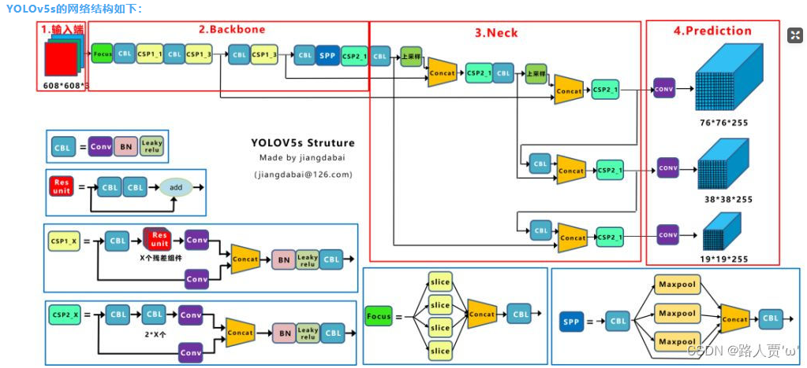
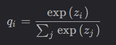
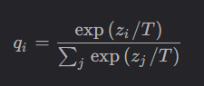
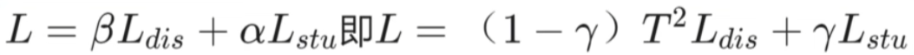

## 基于yolov5+rv1126的驾驶员疲劳检测终端

#### 1.Yolov5简介

**实时性   低资源消耗    高效性   端到端    多任务学习**

yolov5源码路径：[ultralytics/yolov5: YOLOv5 🚀 in PyTorch > ONNX > CoreML > TFLite (github.com)](https://github.com/ultralytics/yolov5)



（1）输入端：Mosaic数据增强、自适应描框计算、自适应图片缩放

（2）Backbone：Focus（图片进入backbone前，对图片进行切片操作，在每一张图片中每隔一个像素拿到一个值再进行卷积操作）、CBL结构（由Conv+Bn+Leaky+relu组成）CSP结构（分为CSP1_X和CSP2_X）

（3）Neck：FPN+PAN结构

（4）Head：CIOU_Loss

Mosaic数据增强：YOLOv5输入端采用Mosaic数据增强，Mosaic数据增强算法将多张图片按照一定比例组合成一张图片，使模型在更小的范围内识别目标

自适应描框计算：使用单独的脚本进行初始描框计算

自适应图片缩放：确定缩放比例->计算好缩放后的图片大小->计算黑边填充数值

NMS非极大值抑制：NMS本质上是搜索局部极大值，抑制非极大值元素，即抑制检测时冗余的框

#### 2.Linux系统移植

**RV1126扩展库     uboot       Linux kernel        根文件系统（roofts）**

##### 2.1 U-Boot移植

U-Boot用于引导Linux系统，初始化DDR外设，将Linux内核从flash拷贝到DDR运行

U-Boot启动流程：

入口程序：u-boot.lds 该代码的入口点：___start   该文件在arch/arm/lib/ectors.S中有定义，设置了中断向量表；image_copy_start存放在0x87800000;进入到reset函数中-->save_boot_params函数，定义在start.S里--->save_boot_params_set函数：读取cpsr中寄存器，保存到r0中，将r0的值与0X1F进行运算，结果保存到r1中，目的是取cpsr的bit0~bit4，这5位M[4:0]用来设置处理器的工作模式 --- >读取CP15中c1寄存器的值到r0寄存器中，清除SCTLR寄存器中的bit13，该位是向量表控制位，0代表向量表基地址为0X00000000，软件可以重定位向量表，1代表基地址为0XFFFF0000，软件不能重定位；将r0值写入寄存器SCTLR中；设置r0值位—start，—start就是整个uboot的入口地址0X87800000，也是向量表的起始地址；将r0值写入到CP15的c12寄存器中，也就是VBAR寄存器，设置向量表重定位的；---->cpu_init_cp15函数用来设置CP15相关内容，比如关闭MMU...---->cpu_init_crit函数调用low_level_init函数---->s_init函数，判断CPU类型，对于I.MX6UL来说，就是个空函数---->进入main函数,设置SP指针为CONFIG_SYS_INIT_SP_ADDR（0X0091FF00），sp做8字节对齐，读取sp到寄存器r0里面，r0=0X0091FF00，调用board_init_f_alloc_reserve，此函数有一个参数，参数为r0的值（0X0091FF00），该函数的主要作用是留出早期的malloc区域和gd内存区域----->board_int_f函数：初始化外设，比如串口、定时器，或者打印一些消息等 and 初始化gd的各个成员变量，uboot会将自己重定位到DRAM最后面地址区域，也就是将自己拷贝到DRAM最后面的内存区域，目的是为了给Linux腾出空间；---->relocate_code函数用于代码拷贝的，uboot对于重定位后链接地址和运行地址不一致的解决办法就是采用位置无关码----->relocate_vectors函数用于重定位向量表的---->board_init_r函数：前面的board_init_f函数并没有初始化所有的外设，而board_init_r来完成后续工作的----->进入到run_main_loop函数：uboot启动后会进入3s倒计时，如果在3s倒计时之前按下回车键，就会进入uboot命令模式，否者就启动Linux内核，该功能就是由run_main_loop函数完成的，里面的cli_loop函数是命令模式下，处理各种命令操作的，里面调用的是parse_stream_outer函数的---->启动内核过程：在启动Linux内核的时候都会用到一个重要的全局变量images，里面包含了系统镜像的信息----->do_bootz函数---->bootz_start函数---->bootz_setup函数   从do_bootz函数后继续调用bootm-find_images函数，do_bootm_states函数---->bootm_os_get_boot_func函数----->do_bootm_linux函数---->boot_jump_linux函数----->最后进入kernel_entry(0, machid, r2)启动内核；zero:0，machid:机器ID，r2:ATAGS或者设备树（DTB）首地址

最终的内存分配图：


bootz命令的内核启动流程如下：


##### 2.2Linux内核移植

**内存管理  进程管理 调度算法  文件系统  设备管理  网络系统**

多个程序运行在内存中，需要将他们访问的地址隔离开来，因此需要虚拟内存系统，将不同进程的虚拟地址和不同内存的物理地址映射起来，其中的映射是使用MMU内存管理单元来实现的。为保证有序组织内存中的数据，将**内存分段**：代码段、数据段、栈段、堆段，但会产生内存碎片和内存交换效率低问题，内存碎片分为内部内存碎片和外部内存碎片，这种方式会出现外部内存碎片问题，解决的办法就是内存交换，将物理内存中的部分交换到磁盘上，以释放物理内存空间供其它程序或进程使用的过程，由于这一过程对磁盘的访问速度较慢就是显得很卡顿。分段的好处可以产生连续的内存空间，但会出现以上问题，因此出现了**内存分页**，分页是把整个虚拟和物理内存空间切分成一段段固定尺寸的大小，叫页，Linux下，一页占4KB。由于内存分页机制分配的内存最小单位是一页，即使程序不足一页大小，也智能分配一页，这会造成内部内存碎片的问题，如果内存不够分配的会将[最近没被使用]的页面换出到硬盘上（不需要把整个程序都加载到内存中），待需要时，再换入到内存中，为了解决产生的页表过大的问题，就有了多级页表

内存分为：内核空间和用户空间

用户空间：代码段：包括二进制可执行代码   数据段：包括已初始化的静态常量和全局变量  BSS段：包括未初始化静态常量和全局变量  堆段：包括动态分配的内存，向上增长  文件映射段：包括动态库、共享内存等，向上增长  栈段：包括局部变量和函数调用的上下文等。栈的大小一般是8MB

每个进程的用户空间都是独立的，不能相互访问，就需要IPC机制：{管道，消息队列，共享内存，信号量}。多个线程竞争同一个资源时会导致数据错乱，这时需要互斥机制，来保证对临界区资源访问问题。在生产者-消费者线程模型中，还需要保证同步，就是并发的进程/线程在一些关键点需要互相等待与互通消息。当两个线程都在等待对方释放锁，就会导致{死锁}问题。各种锁都是基于互斥锁和自旋锁的，互斥锁加锁失败后，线程会释放CPU，给其它进程，自旋锁加锁失败后，线程会忙等待，知道获取到锁

调度算法：linux系统三大调度机制：进程调度/页面调度/磁盘调度算法

进程调度算法：先来先服务调度算法，最短作业优先调度算法，高响应比优先调度算法，时间片轮转调度算法，最高优先级调度算法，多级反馈队列调度算法

内存页面置换算法：当CPU访问页面不在物理内存中，会产生一个缺页中断，请求操作系统将所缺页调入到物理内存中，当出现缺页中断时，需调入新页面而内存已满时，选择被置换的物理页面：最佳页面置换算法，先进先出置换算法，最近最久未使用的置换算法，时钟页面置换算法，最不常用算法。

磁盘调度算法：略略略

Linux内核启动流程：vmlinux.lds（ENTRY(stext)）是内核的入口地址，确保CPU处于SVC模式，关闭所有中断，获取CPU ID---->_mmap_switched函数---->start_kernel来启动内核，该函数每一个都是一个庞大的知识点----->reset_init()函数，启动RCU锁调度器，调用函数kernel_thread创建kernel_init进程，init进程的PID为1，init进程一开始是内核进程，后面init进程会在根文件系统中查找名为"init"程序运行，再创建kthreadd内核进程，此内核进程的PID为2，负责所有内核进程的调度和管理

##### 2.3 根文件系统移植

内核启动挂载的第一个文件系统，使用busyBox构建

**文件系统：**是操作系统负责管理持久数据的子系统，Linux一切皆文件，Linux文件系统会为每个文件分配两个数据结构：索引节点和目录项，，索引节点inode用来记录文件的元信息。如inode编号，文件大小，访问权限，创建时间，修改时间，数据在磁盘的位置等等，索引节点是文件的唯一标识，一一对应的；目录项dentry用来记录文件的名字、索引节点指针，是由内核维护的一个数据结构，存放在内存，目录项和所以节点的关系可以是多对一的，一个文件可以有多个别名，硬链接的实现就是多个目录项中的索引节点指向同一个文件。文件系统种类繁多，而操作系统希望对用户提供一个统一的接口，于是在系统调用和文件系统引入虚拟文件系统这一中间层，文件系统首先要挂载到某个目录才可以正常使用，比如Linux系统启动时，会把文件系统挂载到根目录。当打开一个文件后，操作系统会跟踪进程打开的所有文件，操作系统为每个进程维护一个打开文件表，文件表里的每一项代表【文件描述符】，所以说文件描述符是打开文件的标识。文件系统的重要功能就是将文件数据和磁盘块对应起来，数据在磁盘的存放方式分为：连续空间存放方式和非连续空间存放方式，非连续空间存放方式又可分为链表方式和索引方式：连续空间存放方式文件头需要存放起始块位置和长度，读写效率高，但会产生磁盘空间碎片和文件长度不易扩张的缺陷。非连续存放方式中的链表方式又分为：隐式链表和显式链表，隐式链表存放方式的文件头要包含第一块和最后一块的位置，每个数据块还要留出一个指针空间用于存放下一个数据块的位置，这种的缺点就是智能顺序访问文件，无法随机访问，以及数据块指针消耗了一定的存储空间；如果将每个磁盘块的指针，吧它们放在内存的一个表(FAT文件分配表)中，这就叫显示链接，该表在整个磁盘仅设置一张，每个表项中存放链接指针，指向下一个数据块号；索引方式：为每个文件创建一个【索引数据块】，里面存放的是指向文件数据块的指针列表，文件头还需要包含指向索引数据块的指针，这就可以通过文件头得到索引数据块的位置。


位图法管理空闲空间0110101001010111100101

软链接和硬链接：硬链接是多个目录项中的【索引节点】指向一个文件，也就是指向同一个inode；软链接相当于重新创建了一个文件，这个文件有独立的inode，但是这个文件的内容是另外文件的路径，所以访问软链接时，实际上是访问到了另一个文件，是可以跨文件系统的。

**文件I/O**

缓冲与非缓冲I/O  直接与非直接I/O  阻塞和非阻塞I/O   同步和异步I/O

缓冲I/O，利用的是标准库的缓存实现文件的加速访问，而标准库再通过系统调用访问文件；非缓冲I/O，直接通过系统调用访问文件，不经过标准库缓存，这两者的差别就是是否使用了标准库中的【缓冲】。同理，根据是否利用操作系统的缓存，可以把文件I/O分为直接I/O和非直接I/O，直接I/O，不会发生内核缓存和用户程序之间数据复制，而是直接经过文件系统访问磁盘，非直接I/O，读操作时，数据从内核缓存中拷贝给用户程序，写操作时，数据从用户程序拷贝到内核缓存，再由内核缓存决定什么时候写入数据到磁盘中。

阻塞I/O：当用户程序执行read，线程会被阻塞，一直等到内核数据准备好，并把数据从内核缓冲区拷贝到应用程序的还出去去，当拷贝完成后，read才返回，阻塞等待的是【内核数据准备好】和【数据从内核态拷贝到用户态】这两个过程。

非阻塞I/O，非阻塞的read请求在数据未准备好的情况下立即返回，可以继续执行，此时应用程序不断的轮询内核，直到数据准备好，内核将数据拷贝至应用程序缓冲区，read调用才获取到结果。但这种方式需要傻乎乎的不断轮询数据是否准备好，因此天才的程序员开发了I/O多路复用技术，如select,poll,epoll，它是通过I/O事件分发，当内核数据准备好时，再以事件通知应用程序进行操作。以上都是同步调用的，而真正的异步I/O是【内核数据准备好】和【数据从内核态拷贝到用户态】这两个过程都不用等待，发起aio_read之后，立即返回，内核自动将数据从内核空间拷贝到应用空间，这个拷贝是自动完成的。

#### 3 V4L2摄像头驱动框架

**设备树**:最新的CPU及其驱动开发都是基于设备树的，V4L2框架也不例外

描述设备树的文件叫做DTS，采用树形结构描述板级设备。DTS\DTB和DTC的关系：DTS是设备树的源码文件，DTC工具相当于编译器，将DTS--->DTB二进制文件，，通过make dtbs编译所有的DTS文件，make xxxx.dtb编译某个DTS文件。

**DTS语法：**设备树也支持头文件包含，头文件的扩展名为.dtsi

```Device Tree
/dts-v1/
#include<xxx/input.h>
#include"imx6ull.dtsi"
/ {  /* /:根节点 */
    model = "xxxx";
    compatible = "xxxxx";
    chosen {
    	stdout-path = &uart1;
	};
	aliases {
	};
    memory {
	};
    backlight {
	};
    pxp_v4l2 {
	};
	intc:interrupt-controller@00a01000 { 
			/*intc:节点标签，interxxxller:节点名字，00a01000节点寄存器的起始地址*/
	};
    xxxxxxx
};
&cpu0 {  /* &label 追加属性 */
};
xxxxxxx
```

内核启动时会解析设备树，ls /proc/device-tree/查看所有的设备树节点

这些子节点就是描述外设相关数据的,其中有两个特殊节点，aliases定义别名，为了方便访问节点，chosen：uboot里面的bootargs环境变量值，传递给Linux内核作为命令行参数，这是因为uboot中的fdt_chosen函数会查找chose节点，添加bootargs属性，特殊的属性，compatible属性，值是字符串，格式："manufacturer,model",....，model属性，描述模块信息，status属性，取值："disabled","okey",#address-cells和#size-cells属性：代表子节点地址所占的字长和长度所占的字长，reg属性：（address,length）大部分描述设备起始地址长度，ranges属性：作地址映射.根节点的compatible属性：和Linux内核匹配，是否支持这个设备。了解常用的of操作函数，获取到dts中节点属性的值，给到操作系统。

最后Linux会解析DTB文件，在相应的目录下生成相应的设备树节点文件。

内核解析并获取设备树节点属性的函数是：probe函数，该驱动文件会匹配某个节点的compatible属性，看是否与我的匹配，匹配了就进行节点属性的获取并解析。设置好设备树文件后，就可以使用gpio子系统...提供的API函数操作指定的GPIO.驱动框架的编写：

```c
#include <linux/xxx.h>

/*gpioled设备结构体*/
struct gpioled_dev{
    dev_t devid; //设备号
    struct cdev cdev; //cdev，表示一个字符设备
    /*用于自动创建设备节点 省去mknod命令*/
    struct class *class; //类
    struct device *device; //设备
    int major; //主设备号
    int minor; //次设备号
    struct device_node *nd; //设备节点
    int led_gpio;//led所使用的GPIO编号
}
struct gpioled_dev gpioled; //led设备

/*设备操作函数集*/
static struct file_operations gpioled_fops = {
    .owner = THIS_MODLE,
    .open = led_open,
    .read = led_read,
    .write = led_write,
    .release = led_release,
}
static int __init led_init(void)
{
    int ret = 0;
    /*设置LED所使用的GPIO*/
    /*1.从设备树中获取设备节点*/
    gpioled.nd = of_find_node_by_path("/gpioled"); //如何需要添加一个led设备首先应在设备树下配置相应的属性 节点
    if(gpioled.nd == NULL){
        printk("gpioled node not find!\n\r");
        return -EINVAL;
	}else{
        printk("gpioled node find!\r\n");
	}
    /*2.获取设备树中的gpio属性 使用of API*/
    gpioled.led_gpio = of_get_named_gpio(gpioled.nd, "led-gpio", 0);
    if(gpio.led_gpio < 0){
        printk("can't get led-gpio");
        return -EINVAL;
	}
    printk("led-gpio num = %d\r\n",gpio.led_gpio);
    /*3.申请IO 检查GPIO是否被重复使用*/
    ret = gpio_request(gpiole.led_gpio, "led-gpio");
    if(ret){
        printk("Failed to request the led gpio\r\n");
        ret = -EINVAL;
        return ret;
	}
    /*4.设置GPIO1_IO03为输出，并且输出高电平，默认关闭led*/
    ret = gpio_direction_output(gpioled.led_gpio, 1);
    if(ret < 0){
        printk("cant set gpio!\r\n");
	}
    /*注册字符设备驱动*/
    /*1.创建设备号*/
    if(gpioled.major){ /*定义了设备号*/
        gpioled.devid = MKDEV(gpioled.major, 0);
        register_chrdev_region(gpioled.devid, GPIOLED_CNT, GPIOLED_NAME);
	}else{	//没有定义设备号
        alloc_chrdev_region(&gpioled.devid, 0, GPIOLED_CNT, GPIOLED_NAME);	/* 申请设备号 */
		gpioled.major = MAJOR(gpioled.devid);	/* 获取分配号的主设备号 */
		gpioled.minor = MINOR(gpioled.devid);	/* 获取分配号的次设备号 */
	}
    printk("gpioled major=%d,minor=%d\r\n",gpioled.major, gpioled.minor);	
    /*2.初始化cdev*/
    gpioled.cdev.owner = THIS_MODULE;
    cdev_init(&gpioled.cdev, &gpioled_fops);
    /*3.添加一个cdev*/
	cdev_add(&gpioled.cdev, gpioled.devid, GPIOLED_CNT);
    /*4.创建类*/
    gpioled.class = class_create(THIS_MODULE,GPIOLED_NAME);
    if (IS_ERR(gpioled.class)) {
		return PTR_ERR(gpioled.class);
	}
    /*5.创建设备*/
    gpioled.device = device_create(gpioled.class,NULL,gpioled.devid,NULL,GPIOLED_NAME);
    if (IS_ERR(gpioled.device)) {
		return PTR_ERR(gpioled.device);
	}
	return 0;
    
}
static void __exit led_exit(void)
{
    /*关灯 调用GPIO子系统的API函数*/
    gpio_set_value(gpio.led_gpio, 1);
    /* 注销字符设备驱动 */
	cdev_del(&gpioled.cdev);/*  删除cdev */
	unregister_chrdev_region(gpioled.devid, GPIOLED_CNT); /* 注销设备号 */

	device_destroy(gpioled.class, gpioled.devid);
	class_destroy(gpioled.class);
    /*释放IO*/
    gpio_free(gpioled.led_gpio);
}

module_init(led_init) //驱动入口
module_exit(led_exit);//驱动出口
MODULE_LICENSE("GPL");
MODULE_AUTHOR("cw");
```

总结：1.添加pinctrl信息 2.检查当前设备要使用的IO有没有被其它设备使用，如果有的话要处理 3.添加设备节点，在设备节点中创建一个属性，此属性所使用的gpio 4.编写驱动，获取对应的gpio编号，并申请IO，成功就可以使用该IO pinctrl子系统主要是设置引脚的复用和电气属性的，gpio子系统主要是设置IO的输入输出的。

linux**的并发与竞争**

多个线程操作共享资源时，可能会导致数据混乱的问题，linux提供原子整型操作API函数，先定义原子变量并初始化：atomic_t a = ATOMIC_INIT(0);原子操作的API函数：void atomic_set(atomic_t *v, int i) ...；原子位操作：直接对p地址进行原子操作：void clear_bit(int nr,void *p) ；这些只是适用于整型变量和位临界资源的保护，面对结构体则需要以下方式。

自旋锁spinlock_t：当获取不到锁时，会一直循环等待该锁的释放，CPU使用的效率变低。被自旋锁保护的临界区一定不能调用引起线程休眠和阻塞的API函数，否者会发生死锁现象，使用自旋锁默认关闭CPU抢占。对于中断：当受自旋锁保护的临界区受到中断后，该中段函数抢占了该CPU使用权，但也需要等待锁的释放就也会产生死锁。解决办法之一，获取锁之前可以关闭本地中断。

信号量seaphore：分为计数型信号量和二值型信号量，适用于临界区访问资源时间长的场景，当线程获取不到信号量时，会进入休眠状态以后会切换线程，不用傻乎乎的占着CPU循环等待。

互斥锁mutex：相当于二值型信号量，不能递归的获取互斥锁，也不能在中断中使用，比较常用的一种方式

Linux内核定时器的使用：内核定时器并不是周期性的运行的，超时后就会自动关闭，因此要实现周期性定时，就需要在定时处理函数中重新开启定时器，void init_timer(struct timer_list *timer)初始化定时器，int mod_timer(struct timer_list *timer, unsigned long expires)修改定时器值，如果没有激活就激活定时器，该函数可以做到周期性的定时，int del_timer(struct timer_list *timer)删除一个定时器。

Linux中断的使用：上半部和下半部，将费时的任务放在软中断中的服务函数中。裸机中中断的处理流程是：使能中断，初始化相应的寄存器，注册中断服务函数，在IRQ中断服务函数在数组irqTable里查找具体的中断服务函数，而Linux系统提高了一套构建中断的api函数，使用中断号区分不同的中断，int request_irq(unsigned int irq,irq_handler_t handler,unsigned long flags, const char *name, void *dev)申请一个可用的中断号，void free_irq(unsigned int irq, void *dev);释放相应的中断号，中断处理函数irqreturn_t(\*irq_handler_t)(int, void*)。

应用程序访问设备资源时，有两种方式：阻塞式IO和非阻塞式IO，阻塞访问，可以当设备不可操作时让出CPU使用权，进入休眠状态，当可以访问时，在中断函数里面唤醒该进程，linux内核提供了等待队列来实现阻塞进程的唤醒工作，初始化等待队列头:void init_waitqueue_head(wait_queue_head_t *q)也使用宏DECLARE_WAIT_QUEUE_HEAD等待队列头的定义和初始化，定义并初始化等待队列项DECLARE_WAITQUEUE(name,tsk)，add_wait_queue(q, wait)向等待队列头q添加等待队列项，remove_wait_queue(q,wait)与之相反，wake_up(q)唤醒所有的等待队列头里的进程。非阻塞访问，就需要设备驱动程序提供轮询，select,poll,epoll处理轮询，对应设备驱动poll函数就会执行，，unsigned int (\*poll)(struct file *filp,struct poll_table_struct *wait)。

异步IO：通过"信号"实现，信号是一种软件模拟硬件中断的一种机制。驱动程序的实现：定义fasync_struct结构体，使用异步通知功能还需要在设备驱动中实现file_operations操作集中的fasync函数，里面调用fasync_helper函数来初始化fasync_struct结构体，在满足条件时调用void kill_fasync(struct fasync_struct **fp, int sig, int band)函数向应用程序发出信号。应用程序的实现：注册信号处理函数signal(SIGIO, func),开启异步通知。

##### 3.1 platform设备驱动

驱动的分离和分层：驱动程序移植到另一个平台上难度大，可重用性差，因此linux将驱动分为主机驱动和设备驱动，中间使用统一的API接口。驱动分层的目的是为了在不同的层处理不同的内容，例如input子系统会管理所有和输入有关的驱动，获取输入设备的原始值，上报给input核心层，核心层就会处理各种IO模型，提供file_operations操作集合，编写输入设备驱动的时候就只需要处理好输入事件的上报即可。

设备-总线-驱动 框架：

platform总线：Linux内核使用bus_type结构体表示总线

platform驱动：platform_driver结构体表示platform驱动,继承至device_driver结构体

platform设备：platform_device结构体标识platform设备，如果使用了设备树，就不再使用该结构体描述设备了

驱动和设备的匹配方式有四种，OF类型匹配（设备树匹配方式）of_match_table成员变量保存着驱动的compatible匹配表，该表和设备树节点的compatible属性匹配；ACPI匹配方式；id_table匹配方式；name字段匹配方式。

```c
...
/*platform驱动的probe函数 当设备匹配后就会执行*/
static int led_probe(struct platform_device *dev)
{
	...
}
/*platform驱动的remove函数，移除platform驱动时会执行*/
static int led_remove(struct platform_device *dev)
{
	...
}

/*匹配列表*/
static const struct of_device_id_led_of_match[] = {
	{.compatible = "gpioleds"}.
	{/*Sentinel*/}
};
/*platform驱动结构体*/
static struct platform_driver led_driver = {
	.driver = {
		.name = "imx6ul-led"； //驱动名字
		.of_match_table = led_of_match, //设备树匹配表
	}
	.probe = led_probe,
	.remove = led_remove,
}
//驱动入口
static int __init leddriver_init(void)
{
	return platform_driver_register(&led_driver);
}
//驱动出口
static void __exit leddriver_exit(void)
{
	platform_driver_unregister(&led_driver);
}
modeule_init(leddriver_init);
module_exit(leddriver_exit);
MODULE_LICENSE("GPL");
MODULE_AUTHOR("CW");
```

##### 3.2 v4l2应用程序框架

主要使用ioctl函数来对摄像头驱动控制。

USB摄像头内部结构：视频控制接口和传输接口，CT摄像头终端，IT输入终端，SU选择单元，PU处理单元，OT输入终端。

怎么写一个USB摄像头驱动？

1. 构造一个usb_driver

2. 设置probe：

   2.1 分配video_device:video_device_alloc

   2.2 设置 .fops  .ioctl_ops 如果要用到内核提供的缓冲区操作函数，还需要构造一个videobuf_queue_ops

   2.3 注册：video_register_device

   ​		id_table:和设备树的USB摄像头进行匹配

3. 注册：usb_register

uvc_driver.c驱动分析

1.usb_register(&uvc_driver.driver);

2.uvc_probe

3.通过videoControl Interface来控制，通过VideoStreaming Interface来读取视频数据

VC里含有多个Unit/Terminal等功能模块，可以通过访问这些模块进行控制，比如调节亮度

分析UVC驱动调用过程 ioctl的cmd命令

```c
const struct v4l2_file_operations uvc_fops = {
	.owner = THIS_MODULE,
	.open = uvc_v4l2_open,
	.release = uvc_v4l2_release,
	.ioctl = uvc_v4l2_ioctl,
	.read = uvc_v4l2_read,
	.mmap = uvc_v4l2_mmap,
	.poll = uvc_v4l2_poll,
}
```

1.open:调用uvc_v4l2_open

2.VIDIOC_QUERYCAP //video->streaming->type是在设备被枚举时分析描述符时设置的

```C
if(video->streaming->type == V4L2_BUF_TYPE_VIDEO_CAPTURE)
	cap->capabilities = V4L2_CAP_VIDEO_CAPTURE | V4L2_CAP_STREAMING;
else
	cap->capabilities = V4L2_CAP_VIDEO_OUTPUT | V4L2_CAP_STREAMING;
```

3.VIDIOC_ENUM_FMT //format数组应在设备被枚举时设置的

```c
format = &video->streaming->format[fmt->index];
```

4.VIDIOC_G_FMT //uvc_v4l2_get_format 格式

```c
struct uvc_format *format = video->streaming->cur_format;
struct uvc_fram *frame = video->steaming->cur_frame;
```

5.VIDIO_TRY_FMT //获取格式前检查是否支持该格式

6.VUDIOC_S_FMT	//设置格式

7.VIDIO_REQBUFS //申请视频缓冲区buffer

8.VIDIOC_QUERYBUF //查询每个缓冲区的buffer信息

9.mmap //内存buffer映射

10.VIDIOC_QBUF //将准备好的视频缓冲区buffer入队到空闲链表

11.VIDIOC_STREAMON //开启USB摄像头

12.poll //休眠等待有数据(while轮询)

13.VIDIOC_DQBUF //取出队列中的buffer

14.VISIOC_STREAMOFF //关闭摄像头

>总结: 属性的控制,格式的选择,数据的获得
>
>1.UVC设备2个接口:VideoControl Interface,VideoSteaming Interface
>
>2.VC I用于控制,比如设置亮度.它内部有多个Unit/Terminal(entity实体)
>
>3.VS I用于获得视频数据,也可以用来选择format/frame

YUV格式转RGB格式并缩放到LCD上

>YUV格式:Y:明亮度,U,V表示色度,YUV4:2:0中的420代表YUV的采样率

```
//YUV420 -> RGB888
void YUVImage::yuv2rgb(uint8_t yValue, uint8_t uValue, uint8_t vValue,
        uint8_t *r, uint8_t *g, uint8_t *b) const {
    *r = yValue + (1.370705 * (vValue-128));
    *g = yValue - (0.698001 * (vValue-128)) - (0.337633 * (uValue-128));
    *b = yValue + (1.732446 * (uValue-128));
    *r = clamp(*r, 0, 255);
    *g = clamp(*g, 0, 255);
    *b = clamp(*b, 0, 255);
}
```

#### 4 yolov5模型的量化和剪枝

##### 4.1 yolov5部署在RV126设备上简单流程

>准备数据集,调参,训练得到.pt模型文件

yolov5官方代码: [ultralytics/yolov5: YOLOv5 🚀 in PyTorch > ONNX > CoreML > TFLite (github.com)](https://github.com/ultralytics/yolov5)

>pt模型转为onnx中间格式模型

```python
python3 models/export.py --weights "xxx.pt"
```

>onnx模型转为rknn模型

onnx模型还需要转换为rknn模型才能在RV1126设备上加载,所以需要先搭建rknn-tookit模型转换工具环境:https://github.com/rockchip-linux/rknn-toolkit中的rknn_convert.py脚本

>模型预编译

NPU API加载rknn模型速度极慢,在评估完模型精度没问题之后,可以进行模型预编译.运行precompile_rknn.py脚本文件,将模型预编译生成预编译后的模型文件precompile.rknn

>模型加载和推理

```c
/*算法模型初始化*/
yolov5_detect_init(&ctx, "best.rknn");
/*模型推理*/
yolov5_detect_run(ctx, rgb_img, &detect_result_group);
```

##### 4.2 量化,剪枝和蒸馏

>量化是一种通过减少模型参数的位数来降低模型计算量和内存消耗的技术,深度学习一个参数通常使用32位浮点数来表示,实际推理中,不需要这么高精度的参数表示
>
>剪枝是一种删除模型中不重要的参数和连接来减少模型参数数量和计算量的技术,剪枝算法会识别哪些对模型贡献较少的参数,将其剪枝掉
>
>蒸馏是一种将大型模型的知识转移给小型模型的一种技术

量化的实质就是将模型参数的存储类型从高精度存储降低到低精度存储,从而达到减少模型体积大小,加快模型推理速度的效果,使用yolov5自带的export.py函数

FP32量化(默认32位)

```
python export.py --weights xxx/best.pt --include onnx engine --device 0
```

FP16量化

```
python export.py --weights xxx/best.pt --include onnx engine --half --device 0
```

> 模型大小减少大约一半,推理速度从4.9ms提高到了2.3ms

INT8量化

使用export.py函数导出的效果并不好,不推荐

**剪枝**

对于复杂的网络模型结构,虽然在GPU这种高算力下速度和精确度表现都优秀,但是模型也有可能部署在资源受限的嵌入式CPU或者NUP上,这种算力往往较低,尽管可以将模型量化,可以大大降低计算量,但是只靠这种方式是不够的,还有一种方式从网络结构和参数入手,进行模型的裁剪,比如减少通道数或模型的深度,但这种方式是以牺牲模型精度为代价的...剪枝就是一种使用比较广泛的模型轻量化方法

模型剪枝是一种通过减少神经网络模型中的冗余参数和连接来优化模型的一种方式,旨在减少模型的大小,内存占用和计算复杂度,同时尽可能保持模型精度(要想不损失点精度是不可能的)

>模型剪枝方法:[Learning Efficient Convolutional Networks Through Network Slimming (thecvf.com)](https://openaccess.thecvf.com/content_ICCV_2017/papers/Liu_Learning_Efficient_Convolutional_ICCV_2017_paper.pdf)
>
>剪枝源代码:[https://github.com/foolwood/pytorch-slimming](https://github.com/foolwood/pytorch-slimming)

按比例剪枝,如剪枝比例0.5

    python prune.py --cfg models/yolov5s_voc.yaml --weights runs/exp7_sl-2e-3-yolov5s/weights/last.pt --save-dir runs/exp7_sl-2e-3-yolov5s/weights/ --prob 0.5

按权重大小剪枝,比如小于0.01权重的通道剪

```
python prune.py --cfg models/yolov5s_voc.yaml --weights runs/exp7_sl-2e-3-yolov5s/weights/last.pt --save-dir runs/exp7_sl-2e-3-yolov5s/weights/ --thres 0.01
```

往往是8的倍数时,神经网络推理较快

```
python prune.py --cfg models/yolov5s_voc.yaml --weights runs/exp7_sl-2e-3-yolov5s/weights/last.pt --save-dir runs/exp7_sl-2e-3-yolov5s/weights/ --thres 0.01 --rate 8
```

按通道剪枝

训练原始模型--->计算通道的重要性

- 权重L1范数:计算每个通道权重的L1范数,并选择L1范数较小的通道进行剪枝
- 输出的平均激活值:计算每个通道在训练数据上的平均激活值,并选择平均激活至较小的通道进行剪枝
- 梯度的L2范数:计算每个通道的梯度L2范数,并选择L2范数较小的通道进行剪枝

**知识蒸馏**

知识蒸馏是在一个高精度的大模型和一个低精度的小模型之间建立损失函数，也可以在小模型和原数据样本之间建立损失函数。这个大模型叫做教师网络，小模型叫做学生网络；教师模型引导学生模型进行学习，也就是它们之间建立一个软标签下的损失函数

原始的softmax公式：



引入了温度变量T的softmax公式：



这样就可以将输出的硬标签[0,1,0,0]转为富含更多信息的软标签[0.1,0.8,0.05.0.05]进行损失函数的计算。

>该T温度值高低改变时学生模型训练过程中对负标签的关注程度.T越小，对负标签关注也越小


如上图，T只用作用于教师网络和学生网络的蒸馏过程，学生网络和真实数据标签的T取值为1

这样，就得到了两个损失值distillation loss和student loss，训练的整体损失，就是这个损失值的加权和：



经过蒸馏之后的模型，不仅模型大小变小了，模型的精确度也有所上升。

YOLOv5**知识蒸馏**

>参考代码：https://github.com/Adlik/yolov5

修改train.py文件得到train_distillation.py

```python
parser.add_argument('--t_weights', type=str, default='./weights/yolov5s.pt',
                        help='initial teacher model weights path')
parser.add_argument('--t_cfg', type=str, default='models/yolov5s.yaml', help='teacher model.yaml path')
parser.add_argument('--d_output', action='store_true', default=False,
                    help='if true, only distill outputs')
parser.add_argument('--d_feature', action='store_true', default=False,
                    help='if true, distill both feature and output layers')
```

t_weights ：教师模型权重加载路径

t_cfg：教师模型配置，和学生模型配置类似

d_feature：默认关闭
