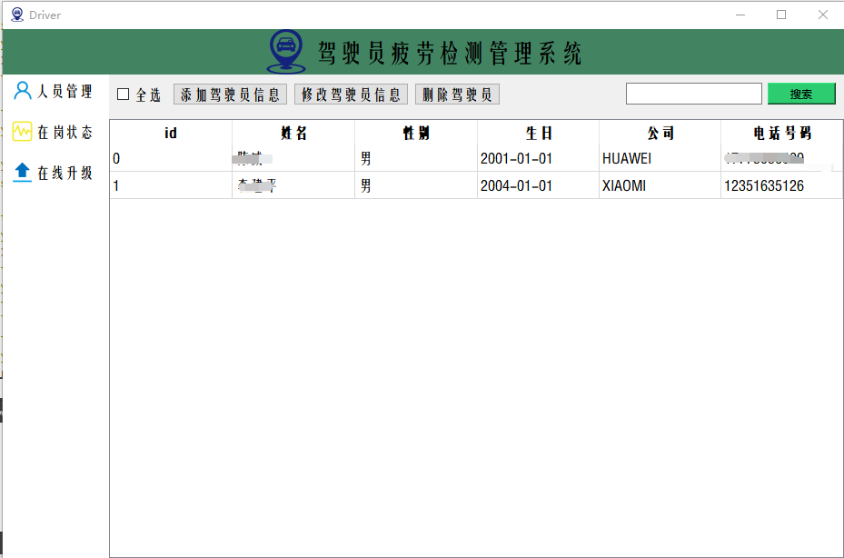
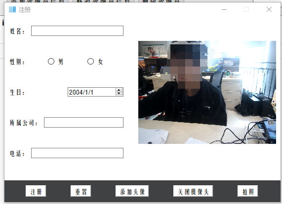

## 基于yolov5+rv1126的疲劳驾驶检测系统

#### 1 系统架构

本系统分为终端设备程序和客户端管理程序

终端：采用训练好的yolov5神经网络模型实现端侧部署，这样做的好处是能保护用户隐私，也能在网络环境差的条件下做到无缝识别。目前终端设备的实时检测可以达到30FPS的识别帧率。

客户端：采用QT6实现对驾驶员信息的注册、在岗状态的查询以及实现终端设备的OTA在线模型升级

#### 2.技术点

| AI模型部署     | uboot和linux的移植 | V4L2 摄像头驱动框架 |
| -------------- | ------------------ | ------------------- |
| 交叉编译工具链 | QT界面编程         | MySql数据库         |
| TCP/IP网络编程 | 多线程             | OpenCV              |

将从以上技术方面进行分析

#### 3.业务流程

终端：终端设备的疲劳驾驶检测采用微瑞芯rv1126实现，首先点击摄像头设备，打开摄像头，设备会自动进行人脸的认证，将人脸数据发送到服务端进行识别认证，服务端通过人脸信息库的比对，如果比对成功则返回识别正确的结果给终端实现身份认证，进而开始实时的疲劳驾驶检测，根据疲劳程度和分心程度来综合评价该驾驶员是否处于危险驾驶状态，并给出警报（蜂鸣器响）

服务端：分为三大模块，人员管理、在岗状态和在线升级，创建两张mysql数据库：驾驶员信息库和人脸数据库，可以采用注册方式向两张数据库中添加用户，后台检测模块接收到终端人脸数据采用seetaFace2进行比对认证（seetaFace2是使用ResNet50网络当做识别模块的，速度可以达到77FPS）采用QChartView进行每个驾驶员的在岗状态进行可视化监视，还附加了在线升级模块，以期实现神经网络的远程动态加载和释放，提高系统的识别准确度。

#### 4.系统效果图

疲劳驾驶检测管理系统界面：

驾驶员信息注册模块：

驾驶员在岗状态信息图表

人脸认证终端界面

yolov5疲劳检测终端界面

哎，现在看着这个界面做得还是一坨屎一样，没办法，没啥时间优化界面了，如果小伙伴们想重做这个界面可以采用QT Quick框架